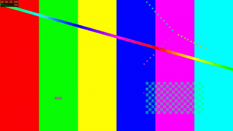

# showrunner

**An AI-programmed linear TV channel.** A cloud playout engine that turns a
media library into a 24/7 HLS live stream, with Claude as the programming
director.

> *"Program Saturday evening as a 90s action night, family-friendly until
> 21:00"* → a valid, gapless broadcast schedule.



*The live channel cycling through synthetic test-pattern assets: a continuous
HLS stream assembled from pre-cut segments with a discontinuity at each join.*

## How it works

No video is processed at playout time. Assets are normalized to one uniform
spec and pre-cut into HLS segments at ingest; the "channel" is a **stateless
manifest generator** that maps wall clock + schedule onto pre-cut segments,
the same manifest-stitching architecture behind most FAST channels
(Pluto, Samsung TV Plus). Because every manifest is a pure function of
`(epoch, catalog, schedule, wall clock)`, replicas agree byte-for-byte,
restarts can't drift the channel, and horizontal scaling is free.

**Documentation:** [Architecture](docs/architecture.md) ·
[API reference](docs/api.md) · [Operations](docs/operations.md) ·
[Roadmap (PLAN.md)](PLAN.md)

## Quickstart

Requires Python 3.12+ and FFmpeg.

```bash
python -m venv .venv && source .venv/bin/activate
pip install -r requirements.txt -r requirements-dev.txt

# Generate synthetic demo assets (FFmpeg test sources: no real media needed)
python scripts/make_demo_assets.py

# Start the channel
uvicorn app.main:app --reload
```

Then open **http://localhost:8000/** for the demo player, or point VLC at
`http://localhost:8000/channel/demo/playlist.m3u8`.

Or with Docker:

```bash
docker compose up --build
```

## Endpoints

| Endpoint | Description |
|---|---|
| `GET /channel/demo/playlist.m3u8` | Live HLS media playlist (sliding window) |
| `GET /channel/demo/now` | On-air / up-next JSON |
| `POST /ingest` | Upload a video (multipart: `file`, `title`) and normalize + segment it |
| `PUT /schedule` | Replace the programme schedule |
| `POST /schedule/generate` | AI director: brief to validated schedule |
| `GET /epg.xml` | Electronic programme guide (XMLTV) |
| `GET /demo/` | hls.js demo player with live on-air bar and guide |

Every endpoint, with request and response shapes, is in the
[API reference](docs/api.md).

## Ingesting your own video

By default the channel plays the JSON demo catalog. To ingest real files into
the database-backed catalog and have the channel air them:

```bash
export SHOWRUNNER_CATALOG_SOURCE=db      # channel reads ingested assets
uvicorn app.main:app --reload

curl -F "title=Late Night Movie" -F "file=@movie.mp4" http://localhost:8000/ingest
# → {"job_id": "...", "asset_id": "late-night-movie-xxxxxxxx", "status": "pending"}
```

Ingest runs in-process by default (no broker needed). Set `SHOWRUNNER_BROKER`
to route it to a Celery worker, and `SHOWRUNNER_STORAGE=s3` to store segments
in MinIO/S3; see `docker compose --profile full up`. Uploads are capped by
`SHOWRUNNER_MAX_UPLOAD_BYTES` (default 4 GiB); larger files get a 413.

## Programming a schedule

Without a schedule the channel simply loops the whole catalog. Define a
programme schedule: assets at target offsets within a repeating cycle, with a
filler asset looping to cover every gap:

```bash
curl -X PUT http://localhost:8000/schedule -H 'content-type: application/json' -d '{
  "filler_asset_id": "ident-xxxxxxxx",
  "period_seconds": 3600,
  "entries": [
    {"asset_id": "movie-xxxxxxxx", "start_offset": 1200}
  ]
}'
```

The schedule is validated before it's stored (no overlaps, nothing past the
period, filler required) and takes effect immediately. Timing is
segment-accurate: a programme starts within one segment (~4s) of its target,
which is what keeps the cycle drift-free. `DELETE /schedule` reverts to
looping the catalog.

Add `ad_breaks` (offset + duration within the cycle) to emit
`EXT-X-CUE-OUT`/`EXT-X-CUE-IN` markers in the manifest; the ad avails an
SSAI/SCTE-35 system replaces with real ads:

```json
{ "filler_asset_id": "ident-...", "period_seconds": 3600,
  "entries": [{"asset_id": "movie-...", "start_offset": 1200}],
  "ad_breaks": [{"start_offset": 1180, "duration": 30}] }
```

## AI programming director

Instead of hand-writing a schedule, describe what you want and let Claude
build it. Set `ANTHROPIC_API_KEY`, tag assets with metadata, then:

```bash
curl -X PATCH http://localhost:8000/assets/movie-xxxx \
  -H 'content-type: application/json' \
  -d '{"genre": "action", "rating": "PG-13", "year": 1994}'

curl -X POST http://localhost:8000/schedule/generate \
  -H 'content-type: application/json' \
  -d '{"brief": "A 90s action night, family-friendly until 21:00, idents between films", "period_seconds": 10800}'
```

Claude inspects the catalog via tool calls and submits a schedule; the server
validates it with the same rules as `PUT /schedule` and hands back any
violations for Claude to fix. The engine only ever airs a schedule that passed
validation: the model proposes, deterministic validation disposes. The
accepted schedule is persisted and goes live immediately.

## Multiple channels

One asset library can drive many independent channels, each with its own name,
epoch, schedule, and ad breaks:

```bash
curl -X POST http://localhost:8000/channels \
  -H 'content-type: application/json' -d '{"id": "news", "name": "News 24"}'
curl -X PUT http://localhost:8000/channels/news/schedule \
  -H 'content-type: application/json' -d '{ ... }'
# → http://localhost:8000/channel/news/playlist.m3u8
```

Every channel gets its own manifest, EPG, and (optionally) AI-generated
schedule. The Go origin serves them all from a directory of snapshots
(`python scripts/export_snapshot.py --all <dir>`).

## True-encode mode (optional)

For channels that need burned-in graphics (a channel bug, a lower-third), a
continuous FFmpeg process can re-encode the channel into one branded stream
instead of stitching manifests. It trades the stateless properties for
frame-accurate graphics:

```bash
curl -X POST http://localhost:8000/channel/demo/encode/start
# serves /encoded/demo/playlist.m3u8 with the channel name burned in
curl -X POST http://localhost:8000/channel/demo/encode/stop
```

See [Architecture](docs/architecture.md#true-encode-mode-the-alternative).

## Go manifest origin

The manifest is a pure function of the wall clock, so a stateless Go origin
(`go-origin/`) can serve it from a schedule snapshot with no database or
scheduler. It is validated byte-for-byte against 126 golden manifests
generated by the Python renderer, and serves about 16x the throughput of one
uvicorn worker (~147,000 vs ~8,900 requests/sec, `wrk -t4 -c64 -d10s` on
Apple Silicon; reproduce with `./scripts/bench.sh`).

Details and the control-plane/data-plane split:
[Architecture](docs/architecture.md#control-plane--data-plane-split-the-go-origin),
[Operations](docs/operations.md#performance--the-go-origin).

## Soak testing

`tests/test_soak.py` fast-forwards a full day of playout through the resolver
and asserts no gaps, monotonic sequences, exact PROGRAM-DATE-TIME continuity,
and zero drift. To soak a running server over real time:

```bash
python scripts/soak.py --url http://localhost:8000 --duration 300
python scripts/soak.py --duration 86400 --ffmpeg-check   # full 24h + decode
```

It exits non-zero on any stall, drift, or unfetchable segment.

## Tests

```bash
pytest -v
```

The suite covers the timeline resolver's edge cases (asset joins, cycle wrap,
discontinuity sequencing, drift over 1000 cycles) because that math is where
playout engines live or die. The Go origin has its own tests:
`cd go-origin && go test ./...`.

## Status

All seven phases of the [roadmap](PLAN.md#5-phased-roadmap) are complete. CI
runs the Python suite and the Go golden test.

## License

MIT
