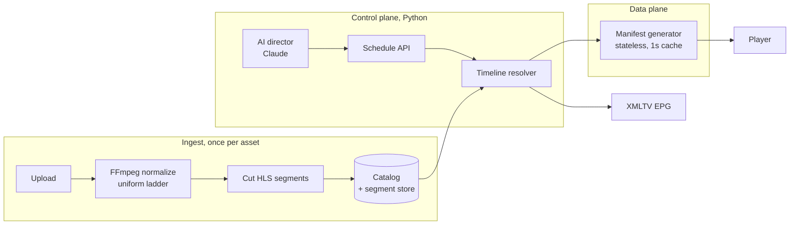

# Architecture

showrunner assembles a media library into a continuous, live HLS television
channel, and lets an LLM program it. This document explains how, and why the
design holds up.

## The core idea: playout as a pure function of time

A linear channel is "always on": at any instant there is exactly one thing on
screen, and it advances on its own. The naive way to build that is a process
that *ticks* (holds a cursor, advances it on a timer) and streams whatever it's
pointing at. That process is stateful, and state is where playout bugs live:
restart it and the cursor resets; run two for redundancy and they disagree;
let it run for days and rounding error accumulates into visible drift.

showrunner takes the opposite approach. **Nothing ticks.** The channel is a
pure function:

```
manifest = f(epoch, catalog, schedule, wall_clock)
```

Every HLS media playlist is computed from scratch on each request, derived
entirely from the wall clock and a fixed description of the channel. There is
no cursor, no timer, no in-memory position. This one decision buys three
properties for free:

- **Restart-safe**: a fresh process computes the identical answer; a crash
  mid-stream is invisible to viewers.
- **Horizontally scalable**: N replicas agree byte-for-byte, so you can put
  any number behind a load balancer with no coordination.
- **Drift-free**: because each request recomputes from the wall clock, error
  cannot accumulate. (See *No drift, by construction* below.)

## Manifest stitching, not re-encoding

There are two ways to produce a channel:

| | How | Trade-off |
|---|---|---|
| **True playout** | One encoder runs 24/7, switching inputs live | Frame-accurate, supports live graphics, but brutally stateful (clock discipline, gapless input switching, encoder crashes) |
| **Manifest stitching** | Assets are pre-cut into HLS segments once; the "channel" is a web service that emits a sliding-window playlist over those segments | No video processing at playout time at all, the property that makes the pure-function design possible |

showrunner's default is manifest stitching (it's also how most FAST channels,
like Pluto and Samsung TV Plus, actually run). True playout is available as an
[optional mode](#true-encode-mode-the-alternative).

The key enabler is **normalization at ingest**: every asset is transcoded to
one identical spec (resolution, fps, GOP size, audio layout) with keyframes
forced at the segment boundary, then cut into segments. Because every segment
across every asset is encoded the same way, they're interchangeable: the
channel can splice from any asset to any other, and players decode it as one
stream (with a discontinuity marker at each join).

## The pipeline



- **Ingest** (`app/ingest/`): upload → FFmpeg normalize → segment → ffprobe
  each segment for its *exact* duration → register in the catalog. Runs
  eagerly in-process or on a Celery worker.
- **Catalog** (`app/models.py`, `app/core/catalog.py`): SQLAlchemy over
  SQLite (dev) or Postgres (prod). Holds assets, segments, schedules,
  ad breaks, channels, ingest jobs.
- **Timeline resolver** (`app/core/timeline.py`, `app/core/schedule.py`): the
  heart. Maps a wall-clock instant to the segment window on air. Two
  implementations behind one interface: `LoopingTimeline` (loops the catalog)
  and `ScheduledTimeline` (programmes at offsets with filler).
- **Manifest generator** (`app/core/manifest.py`): renders a resolver
  `Window` as an RFC 8216 media playlist. Cached 1 second per channel.
- **Delivery**: segments are served by the app in dev, by nginx/CDN in prod;
  the app never touches segment bytes on the hot path.

## The timeline resolver

Both timeline types flatten one **cycle** of the channel into an ordered list
of segments, each tagged with its source asset and its position within that
asset. Given a wall-clock `now`:

1. `position = now - epoch` (seconds).
2. `cycle, phase = divmod(position, cycle_duration)`.
3. Binary-search the phase against the segments' cumulative start offsets to
   find the current segment index.
4. The global segment index is `cycle * n + index`.
5. The live window is the last *N* segments ending there.

Everything else (`PROGRAM-DATE-TIME`, media sequence, discontinuity sequence)
derives from that global index arithmetically.

### No drift, by construction

Segment durations are never nominal. At ingest, each segment's duration is read
back with `ffprobe` (a "4-second" segment is really 4.075s or 3.984s), and the
cycle length is defined as **the sum of its actual segments**: not a target
number. Because every request recomputes `position` from the wall clock and
maps it through those exact durations, there is no accumulator to drift. The
[24-hour soak](../PLAN.md) proves it: walking a full day of segments, the live
edge always contains the wall clock, and `PROGRAM-DATE-TIME` stays continuous to
the millisecond.

### Discontinuities

HLS requires an `EXT-X-DISCONTINUITY` tag wherever the decode timeline breaks,
at every asset join and every loop restart. The resolver marks a segment as a
discontinuity when it does *not* continue the previous one in its asset's
natural order (different asset, or a filler loop wrapping back to its first
segment). `EXT-X-DISCONTINUITY-SEQUENCE` counts the discontinuities that
scrolled off before the window. This accounting is verified segment-by-segment
against a brute-force oracle across multiple cycles (`tests/test_schedule.py`).

## Scheduling and filler

A schedule places programmes at target offsets within the cycle; the space
around and between them is tiled with a **looping filler** asset so the channel
is never off air. Filler is laid as whole segments, so a programme starts within
one segment (~4s) of its target (**segment-accurate, not frame-accurate**),
which is exactly what keeps the cycle drift-free (its length stays the sum of
real segments). Schedules are validated before they're stored: no overlaps,
nothing past the period, filler required, so a channel can never air a broken
schedule.

## The AI programming director

`POST /channels/{id}/schedule/generate` runs a Claude tool-use loop
(`app/ai/director.py`, model `claude-opus-4-8`):

1. Claude calls `list_assets` to see the catalog (durations + genre/rating/year).
2. Claude calls `submit_schedule` with programmes, filler, and ad breaks.
3. The server validates with the **same** `validate_schedule` that guards the
   manual API. Violations are handed back; Claude fixes them and resubmits.
4. Only a schedule that passes validation is persisted and aired.

The model proposes; deterministic validation disposes. The client is injected,
so the whole loop is tested with a scripted fake; no API key needed in CI.

## Control plane / data plane split (the Go origin)

The manifest is the hot path (every viewer polls it every few seconds) but
it's a pure function of the wall clock, so it needs neither the database nor the
scheduler at request time. showrunner splits along that line:

- **Control plane (Python)** does the hard, infrequent work (ingest,
  scheduling, discontinuity resolution) and compiles a channel into a **cycle
  snapshot** (`app/core/snapshot.py`): a flat JSON description of one cycle with
  precomputed discontinuity flags.
- **Data plane (Go, `go-origin/`)** serves manifests from the snapshot with
  pure arithmetic, reimplementing only `render_media_playlist`.

The Go origin is validated **byte-for-byte** against the canonical Python
renderer: `scripts/gen_go_fixtures.py` emits golden manifests from the Python
code and `go test` asserts the Go output matches every one. Result: ~16×
throughput (see [operations](operations.md#benchmark)).

## True-encode mode (the alternative)

For channels that need burned-in graphics (a channel bug, a lower-third),
`app/core/encode.py` offers a traditional playout path: a continuous FFmpeg
process re-encodes the channel's segments (on a loop) into one branded HLS
stream, served under `/encoded/{id}/playlist.m3u8`. This trades the stateless
properties for frame-accurate on-screen graphics. It degrades to a plain bar
overlay when the local ffmpeg lacks the `drawtext` filter.

## Multi-channel

One asset library drives many channels, each with its own name, epoch,
schedule, and ad breaks. Routes are parametric over `channel_id`; the Go origin
serves a directory of per-channel snapshots. See the
[API reference](api.md#channels).
